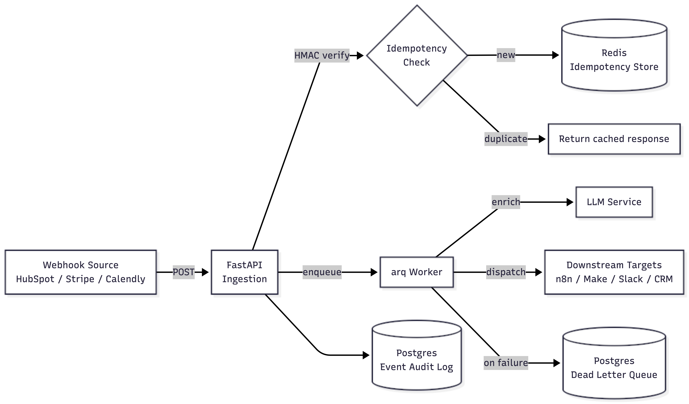
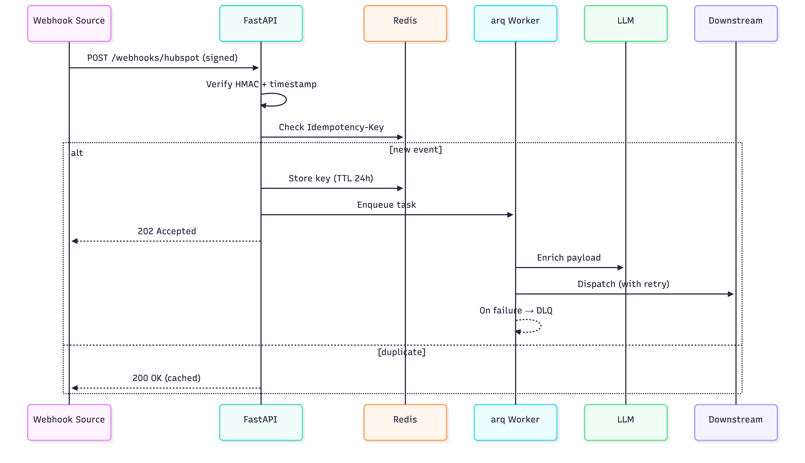

# webhook-ai-router


> Production-grade ingestion service for incoming webhooks. Authenticates, deduplicates, enriches via LLM, and dispatches downstream — with idempotency, retries, and a dead-letter queue. Built to sit between webhook sources (HubSpot, Stripe, Calendly…) and no-code workflows (n8n, Make).

---

## Why this exists

No-code automation tools (n8n, Make) are excellent for orchestration but become fragile when handling:

- High-throughput webhooks (rate limits, race conditions, duplicate deliveries)
- Cryptographic signature verification with replay protection
- LLM-based enrichment as part of the ingestion pipeline
- Reliable fan-out to multiple downstream systems with per-target retry policies
- Persistent state, audit trails, and dead-letter handling

`webhook-ai-router` handles those concerns in a small, focused Python service. Your no-code workflow only sees clean, deduplicated, enriched events.

---

## Architecture



**Request flow:**



---

## Quickstart

```bash
git clone https://github.com/JohnARI/webhook-ai-router.git
cd webhook-ai-router
cp .env.example .env  # fill in OPENAI_API_KEY (or ANTHROPIC_API_KEY) and HMAC_SECRET
docker compose up
```

Service is up on `http://localhost:8000`. API docs at `/docs`.

### Send a test webhook

```bash
bash examples/curl-examples.sh
```

---

## Calling from n8n

In your n8n **HTTP Request** node:

| Field | Value |
| --- | --- |
| Method | `POST` |
| URL | `http://your-host/webhooks/{source}` |
| Headers | `X-Signature: sha256=...`, `X-Timestamp: <unix>`, `Idempotency-Key: <uuid>` |
| Body | Raw JSON event payload |

The service responds `202 Accepted` immediately. Enrichment + dispatch happen asynchronously. Use the returned `event_id` to query status via `GET /events/{id}`.

A ready-to-import workflow is provided in `examples/n8n-workflow.json`.

---

## Calling from Make.com

See `examples/make-scenario.md` for screenshots and the exact module configuration.

---

## Engineering choices

This repository is intentionally a reference implementation. Each pattern is included because it solves a class of production failure I have seen in the wild:

- **Async-first**: FastAPI + `httpx.AsyncClient` + async SQLAlchemy + arq workers. No mixed sync/async traps.
- **Pydantic v2 throughout**: strict request/response models with discriminated unions per webhook source.
- **HMAC verification**: constant-time comparison via `hmac.compare_digest`, plus timestamp window and nonce cache to prevent replay.
- **Idempotency-Key**: Stripe-style. Cached responses returned for duplicate `Idempotency-Key` headers within 24h.
- **Retry with backoff**: `tenacity` with exponential backoff + jitter on outbound calls.
- **Dead-letter queue**: events that exhaust retries are persisted in Postgres with the original payload and full error trace.
- **Structured logging**: `structlog` with JSON output in prod, request IDs propagated through async tasks.
- **Observability**: `/healthz`, `/readyz`, and Prometheus `/metrics` endpoints out of the box.
- **RFC 7807 error responses**: machine-readable errors instead of free-form strings.

---

## Project structure

```text
src/webhook_router/
├── api/         # FastAPI routes, middleware, dependencies
├── core/        # Cross-cutting: security, idempotency, logging, exceptions
├── schemas/     # Pydantic models (request/response/errors)
├── services/    # Business logic: enrichment, dispatch, LLM client
├── workers/     # arq task definitions
├── db/          # SQLAlchemy models and session
└── infra/       # Redis, HTTP clients
```

---

## Development

```bash
make install   # uv sync + pre-commit install
make run       # local dev server with reload
make test      # pytest with coverage
make lint      # ruff + mypy
make fmt       # ruff format
```

Pre-commit hooks run ruff and mypy on every commit. CI runs the full suite on every push.

---

## Roadmap

- [ ] OpenTelemetry tracing
- [ ] Pluggable enrichment providers (OpenAI, Anthropic, local models)
- [ ] Per-source rate limiting
- [ ] Web UI for DLQ inspection and replay

---

## License

MIT
